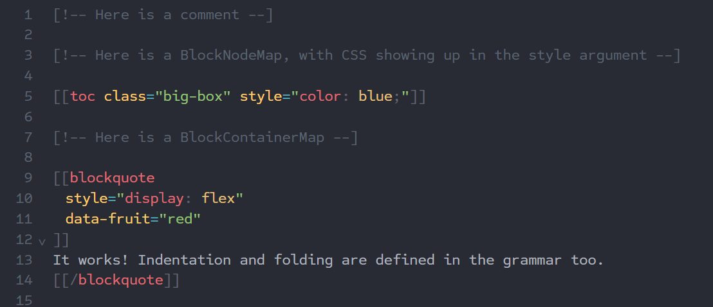

# cm-tarnation

An alternative parser for CodeMirror 6. Its grammar focuses on being extremely flexible while not suffering the consequence of being utterly impossible to understand. It's inspired a bit by the Monarch and Textmate grammar formats, but pretty much entirely avoids the pitfalls of their systems.

Tarnation is _not_ line-based. It is capable of reusing both previous _and ahead_ data when parsing, making it fully incremental. It can restart from nearly any point in a document, and usually only barely parses the immediate region around an edit. It also doesn't use very much memory, due to some clever usage of `ArrayBuffer` based tokens.

Tarnation was created as part of my work on [Wikijump](https://github.com/scpwiki/wikijump/).

### Why?

Tarnation can do things that Lezer (the parser you'd usually use for CodeMirror) can't. For example, Tarnation can parse something like Markdown, and other weird esoteric markup/formatting languages.

However, if you're not trying to make a grammar for some bonkers language, it's probably possible to make a grammar using Lezer. You should almost certainly do this - its grammar format is probably superior to Tarnation's, and it will be faster and better behaved in general.

## Installation

```
npm install cm-tarnation
```

## Usage

Tarnation's grammar is basically a JSON matching a certain schema. It's designed more around YAML, though.

TODO

For now, an example of a highly complex grammar using all available features of Tarnation can be found [here](https://github.com/scpwiki/wikijump/tree/develop/web/modules/cm-lang-ftml/src/grammars), in the `ftml.ts` and `ftml.yaml` files. This grammar is used to parse wikitext for the Wikijump project, in the Sheaf editor.

## Demonstration

This is a simplified form of the grammar linked above:

```yaml
comments:
  block:
    open: "[!--"
    close: "--]"

ignoreCase: true

repository:
  ws: /[^\S\r\n]/
  namela: /_?(?:@ws|@BlockEnd|$)/

  BlockComment:
    match: /(\[!--)([^]+?)(--\])/
    tag: (...) blockComment
    fold: offset(3, -3)
    captures:
      0: { open: BlockComment }
      2: { close: BlockComment }

  BlockStart:
    match: /\[{2}(?![\[/])/
    tag: squareBracket
    closedBy: BlockEnd

  BlockStartClosing:
    match: /\[{2}//
    tag: squareBracket
    closedBy: BlockEnd

  BlockEnd:
    match: /(?!\]{3})\]{2}/
    tag: squareBracket
    openedBy: [BlockStart, BlockStartClosing]

  BlockNamePrefix:
    match: /[*=><](?![*=><])|f>|f</
    tag: modifier

  BlockNameSuffix:
    match: "_"
    lookbehind: '!/\s/'
    tag: modifier

  BlockLabel:
    match: /[^\s\]]+/
    tag: invalid

  BlockNodeArgument:
    match: /(\S+?)(\s*=\s*)(")((?:[^"]|\\")*)(")/
    captures:
      0: { type: BlockNodeArgumentName, tag: special(propertyName) }
      1: { type: BlockNodeArgumentOperator, tag: definitionOperator }
      2: { open: BlockNodeArgumentMark, tag: string }
      3:
        if: $0
        matches: style
        then: { type: CSSAttributes, nest: style-attribute }
        else: { type: BlockNodeArgumentValue, tag: string }
      4: { close: BlockNodeArgumentMark, tag: string }

  BlockNameMap:
    lookup: $var:blk_map # external variable
    lookahead: /@namela/
    emit: BlockName
    tag: tagName

  BlockNameMapElements:
    # lookup is a list of strings that can be matched
    lookup: $var:blk_map_el # external variable
    lookahead: /@namela/
    emit: BlockName
    tag: tagName

  # blocks

  BlockNodeMap:
    emit: BlockNode
    indent: delimited(]])
    skip: /\s+/
    chain:
      - BlockStart
      - BlockNamePrefix?
      - BlockNameMap
      - BlockNameSuffix?
      - BlockNodeArgument |* BlockLabel
      - BlockEnd

  BlockContainerMap:
    emit: BlockContainer
    fold: inside
    begin:
      type: BlockContainerMapStartNode
      emit: BlockNode
      indent: delimited(]])
      skip: /\s+/
      chain:
        - BlockStart
        - BlockNamePrefix?
        - BlockNameMapElements
        - BlockNameSuffix?
        - BlockNodeArgument |* BlockLabel
        - BlockEnd
    end:
      type: BlockContainerMapEndNode
      emit: BlockNode
      indent: delimited(]])
      skip: /\s+/
      chain:
        - BlockStartClosing
        - BlockNamePrefix?
        - BlockNameMapElements
        - BlockNameSuffix?
        - BlockEnd

includes:
  blocks:
    - BlockNodeMap
    - BlockContainerMap

global:
  - BlockComment

root:
  - include: blocks
```

This grammar can yield syntax highlighting that looks like this:


## Contributing

Tarnation is welcome to PRs, issues, etc. If you want to understand how Tarnation works, I made sure to spend a lot of time nicely documenting the source files. It's not all that complicated really. It would help you a lot if you read up on how CodeMirror itself works, though.

### Building

Tarnation is built using TypeScript, with no special build tools. You can use the following command:

```
npm run build
```

## License

MPL 2.0. See the [license file](LICENSE) for more details.
